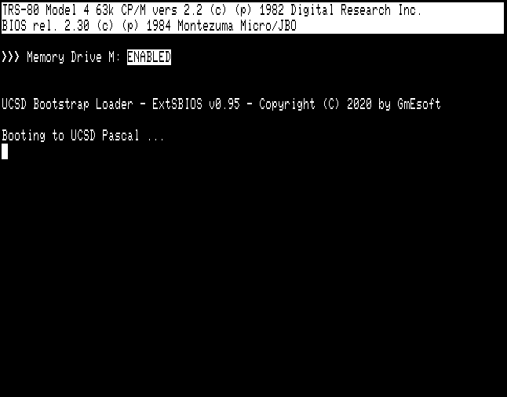
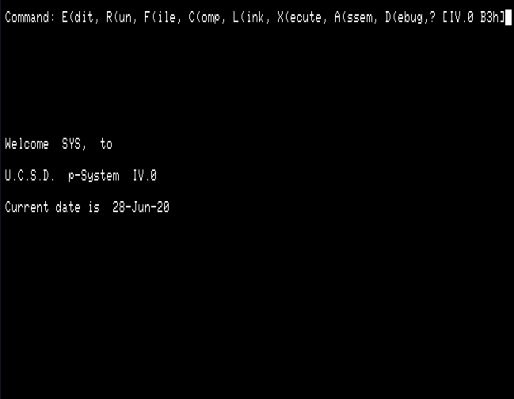
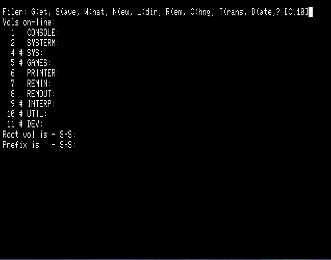
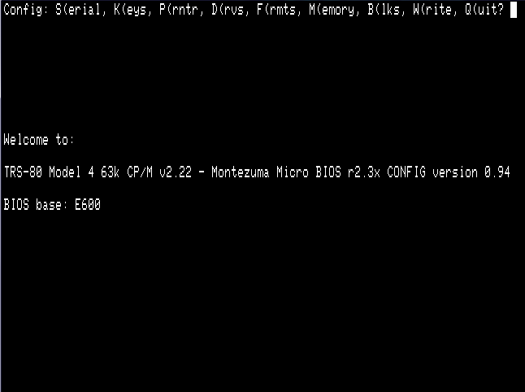

# TRS80_CPM_UCSDP
UCSD Pascal Full-Adaptive p-System IV for TRS-80 Model 4, based on Montezuma Micro CP/M BIOS 2.30

Work in progress. Current state in the [develop](https://github.com/GmEsoft/TRS80_CPM_UCSDP/tree/develop) branch.

Ready-to-use disk images available [here](https://github.com/GmEsoft/TRS80_CPM_UCSDP/releases/tag/v0.1-alpha).

### Booting SBIOS:




### The UCSD Pascal Welcome Screen:




### The Mounted Volumes:




### The CP/M BIOS Config tool:




## Configuring the CP/M BIOS

Start CONFIG.CODE by typing `X(ecute`

`Execute what file? CONFIG`.

The following screen shows up:

````
Config: S(erial, K(eys, P(rntr, D(rvs, F(rmts, M(emory, B(lks, W(rite, Q(uit? _ 
                                                                                
                                                                                
                                                                                
                                                                                
                                                                                
                                                                                
                                                                                
Welcome to:                                                                     
                                                                                
TRS-80 Model 4 63k CP/M v2.22 - Montezuma Micro BIOS r2.3x CONFIG version 0.94  
                                                                                
BIOS base: E600                                                                 
                                                                                
                                                                                
                                                                                
                                                                                
                                                                                
                                                                                
                                                                                
                                                                                
                                                                                
                                                                                
                                                                                
````

The BIOS base address is displayed: E600 for hard disk systems (63k CP/M), EA00 for floppy systems (64k CP/M).


The menu options are:
- `S(erial`: RS-232C Serial interface setup;
- `K(eys`:   Keyboard remapping;
- `P(rntr`:  Printer setup;
- `D(rvs`:   Floppy drives setup;
- `F(rmts`:  Floppy formats setup;
- `M(emory`: Browse memory;
- `B(lks`:   Browse disk blocks;
- `W(rite`:  Write new setup to disk;
- `Q(uit`:   Quit the CONFIG tool.


### `S(erial`: RS/232C Serial interface setup

````
Config Serial: T(xBaud, R(xBaud, D(ataBits, P(arity, S(top, Q(uit? _            
                                                                                
Baud Rate - TX: 300                                                             
            RX: 300                                                             
                                                                                
Data Bits     : 8                                                               
Parity        : N                                                               
Stop Bits     : 1                                                               
DTR line      : 1                                                               
RTS line      : 1                                                               
````

Keys:
- `T(xBaud`: change the TX baud rate (50-75-110-134-150-300-600-1200-1800-2000-2400-3600-4800-7200-9600-19200);
- `R(xBaud`: change the RX baud rate (idem);
- `D(ataBits`: change the number of data bits (5-6-7-8);
- `P(arity`: change the parity (None-Odd-Even);
- `S(topBits`: change the number of stop bits (5-6-7-8);
- `Q(uit`: quit the RS-232C screen.

When quitting this screen, it is asked:

`E(xit without update, U(pdate and leave ?_`

Reply `U` to save the new settings in memory.


### `K(eys`:   Keyboard remapping
````
keyDef: reconfigure keys [Y/N] ?_                                               
````
Reply `Y` to reconfigure the CLEAR and BREAK keys, and reset the CAPS LOCK.

````
<BREAK> and <CLEAR> reconfigured; <CAPS> reset                                  
````

### `P(rntr`:  Printer setup
````
Config Printer: {options}, Q(uit? _                                             
                                                                                
[ A ]  Suppress linefeed after carriage return: 1                               
[ B ]  Simulate formfeed (top-of-form code):    0                               
[ C ]  Page length in lines: 66                                                 
````

Keys:
- `A`: suppress the linefeed following the carriage return, 1=yes, 0=no;
- `B`: Simulate form feed using line feeds, 1=yes, 0=no;
- `C`: Page length - enter the new page length when prompted;
- `Q`: Quit the printer setup screen.


### `D(rvs`:   Floppy drives setup

````
Config Drives: 0..3, Q(uit? _                                                   
                                                                                
Drive Type Tracks Sides Step                                                    
[ 0 ]   5"     40     1    6                                                    
[ 1 ]   5"     40     1    6                                                    
[ 2 ]   5"     40     1    6                                                    
[ 3 ]   5"     40     1    6                                                    
````

Select the physical floppy drive number (0..3) to configure, or type `Q` to quit this screen.

````
Config Drive: A..D, Q(uit? _                                                    
                                                                                
Current settings - Drive 0:                                                     
                                                                                
[ A ]  Type of drive:     5 inch                                                
[ B ]  Number of tracks:  40                                                    
[ C ]  Number of sides:   1                                                     
[ D ]  Step rate (ms):    6                                                     
````

Keys:
- `A`: Type of drive - 5 inch or 8 inch;
- `B`: Number of tracks (for 5 inch only) - 35, 40, 77 or 80 (77 only for 8 inch);
- `C`: Number of sides (1 or 2);
- `D`: Step rate (6, 12, 20 or 30 ms);
- `Q`: Quit the drive setup screen.


### `F(rmts`:  Floppy formats setup

````
Config Drives: A..P, Q(uit? _                                                   
                                                                                
Drive   Physical drive & current format                                         
[ A ]       Hard Disk drive                                                     
[ B ]       Hard Disk drive                                                     
[ C ]       Hard Disk drive                                                     
[ D ]       Hard Disk drive                                                     
[ E ]   0:  MM Std SYSTEM (40T SS DD 170K)                                      
[ F ]   1:  MM Std SYSTEM (40T SS DD 170K)                                      
[ G ]   2:  MM Std SYSTEM (40T SS DD 170K)                                      
[ H ]   3:  MM Std SYSTEM (40T SS DD 170K)                                      
[ I ]       Undefined disk drive                                                
[ J ]       Undefined disk drive                                                
[ K ]       Undefined disk drive                                                
[ L ]       Undefined disk drive                                                
[ M ]       Fixed storage device                                                
[ N ]       Undefined disk drive                                                
[ O ]       Undefined disk drive                                                
[ P ]       Undefined disk drive                                                
````

This example corresponds to a hard disk system. On floppy disk systems, the floppy formats are affected to drives A:..D: .

Select the logical drive letter (A..P) to configure, or type `Q` to quit this screen. Only floppy drive formats can be configured.

````
Config Drive Format: A..P, Q(uit? _                                             
                                                                                
Choose the format to be used for drive E:                                       
                                                                                
[ A ]  MM Std SYSTEM (40T SS DD 170K)                                           
[ B ]  MM Std DATA (40T SS DD 200K)                                             
[ C ]  MM Std DS SYSTEM (40T DS DD 350K)                                        
[ D ]  MM Std DS DATA (40T DS DD 400K)                                          
[ E ]  MM 80T SYSTEM (80T SS DD 350K)                                           
[ F ]  MM 80T DATA (80T SS DD 400K)                                             
[ G ]  MM 80T DS SYSTEM (80T DS DD 710K)                                        
[ H ]  MM 80T DS DATA (80T DS DD 800K)                                          
[ I ]  09                                                                       
[ J ]  10                                                                       
[ K ]  11                                                                       
[ L ]  12                                                                       
[ M ]  13                                                                       
[ N ]  14                                                                       
[ O ]  15                                                                       
[ P ]  16                                                                       
````

Now, select the drive format to use (A..H) or press `Q` to quit this screen.

````
Config Drive Format: A..P, Q(uit? A                                             
                                                                                
Format selected for drive F:                                                    
>>--> MM Std SYSTEM (40T SS DD 170K)                                            
                                                                                
Which physical disk drive is to be used: 0..3, Q(uit? _                         
````

Select the physical drive number to use (0..3) or press `Q` to quit this screen.

If the physical drive number of tracks is twice the number of tracks in the selected format, it will be asked if double stepping is to apply.

````
Config Drive Format: A..P, Q(uit? A                                             
                                                                                
Format selected for drive F:                                                    
>>--> MM Std SYSTEM (40T SS DD 170K)                                            
                                                                                
Which physical disk drive is to be used: 0..3, Q(uit? 1                         
Double step [Y/N] ? _                                                           
````

This allows a 40-track floppy to be read in a 80-track drive.

Press `Q` when the formats have been configured.


### `M(emory`: Browse memory

````
Memory: N(ext, P(rev, >, <, Q(uit ?_                                            
0000  C303 E681 00C3 06D8 00FF 00FF 00FF 00FF  ................                 
0010  00FF 00FF 00FF 00FF 00FF 00FF 00FF 00FF  ................                 
0020  00FF 00FF 00FF 00FF 00FF 00FF 00FF 00FF  ................                 
0030  00FF 00FF 00FF 00FF 00FF 00FF 00FF 00FF  ................                 
0040  00FF 00FF 00FF 00FF 00FF 00FF 00FF 00FF  ................                 
0050  00FF 00FF 00FF 00FF 00FF 00FF 00FF 00FF  ................                 
0060  00FF 00FF 00FF 00FF 00FF 00FF 00FF 00FF  ................                 
0070  00FF 00FF 00FF 00FF 00FF 00FF 00FF 00FF  ................                 
0080  00FF 00FF 00FF 00FF 00FF 00FF 00FF 00FF  ................                 
0090  00FF 00FF 00FF 00FF 00FF 00FF 00FF 00FF  ................                 
00A0  00FF 00FF 00FF 00FF 00FF 00FF 00FF 00FF  ................                 
00B0  00FF 00FF 00FF 00FF 00FF 00FF 00FF 00FF  ................                 
00C0  00FF 00FF 00FF 00FF 00FF 00FF 00FF 00FF  ................                 
00D0  00FF 00FF 00FF 00FF 00FF 00FF 00FF 00FF  ................                 
00E0  00FF 00FF 00FF 00FF 00FF 00FF 00FF 00FF  ................                 
00F0  00FF 00FF 00FF 00FF 00FF 00FF 00FF 00FF  ................                 
````

This command allows to browse the contents of the memory (main 64 kB of RAM).

Keys:
- `N`: Go to next page;
- `P`: Go to previous page;
- `>`: Jump 16 pages forward;
- `<`: Jump 16 pages backward;
- `Q`: Quit this screen.


### `B(lks`: Browse disk blocks

````
Disk: N(ext, P(rev, >, <, Q(uit ?_                                              
0000  F331 0043 3E50 D3EC 3E03 D384 AFD3 E0D3  .1.C>P..>.......                 
0010  CE3E 10D3 CFE3 E3DB CF07 38FB 3E70 D3CF  .>........8.>p..                 
0020  E3E3 DBCF 0738 FB3E 26D3 C911 0230 01C8  .....8.>&....0..                 
0030  002A 7B43 7BD3 CB3E 20D3 CFE3 E3DB CF07  .*{C{..> .......                 
0040  38FB DBCF E601 2055 EDB2 1C7B FE21 2005  8..... U...{.! .                 
0050  1E01 7BD3 CC15 20DC 016F 432A 7B43 E523  ..{... ..oC*{C.#                 
0060  5E71 2356 70ED 537B 43E1 0100 1609 E911  ^q#Vp.S{C.......                 
0070  FAF2 217D 4301 2000 EDB0 C300 D0C0 FC70  ..!}C. ........p                 
0080  FD20 FED0 FE93 F1A3 F1B3 F1C3 F100 0000  . ..............                 
0090  0000 0000 00D3 F100 0000 0000 003E 02D3  .............>..                 
00A0  8421 AE43 1100 F801 1500 EDB0 18FE 4861  .!.C..........Ha                 
00B0  7264 2044 6973 6B20 424F 4F54 2045 5252  rd Disk BOOT ERR                 
00C0  4F52 2100 0000 0000 0000 0000 0000 0000  OR!.............                 
00D0  0000 0000 0000 0000 0000 0000 0000 0000  ................                 
00E0  0000 0000 0000 0000 0000 0000 0000 0000  ................                 
00F0  0000 0000 0000 0000 0000 0000 0000 0000  ................                 
````

This command allows to browse the contents of the system disk (unit #4).

Keys:
- `N`: Go to next page;
- `P`: Go to previous page;
- `>`: Jump 16 pages forward;
- `<`: Jump 16 pages backward;
- `Q`: Quit this screen.


### `W(rite`:  Write new setup to disk

````
Config: S(erial, K(eys, P(rntr, D(rvs, F(rmts, M(emory, B(lks, W(rite, Q(uit? _ 
E600,52 sectors: ....................................................           
Configuration saved                                                             
````

The configured BIOS is rewritten back to the system disk.


### `Q(uit`:   Quit the CONFIG tool

This terminates the CONFIG utility session.
